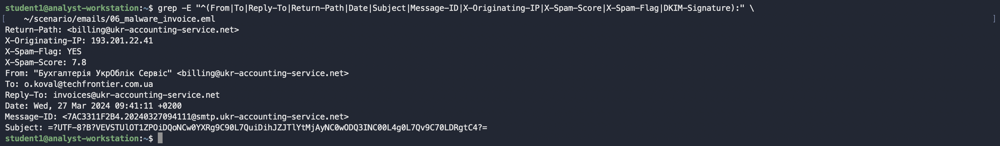
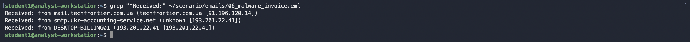
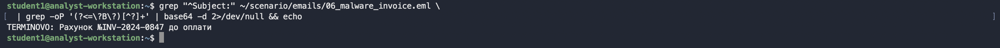
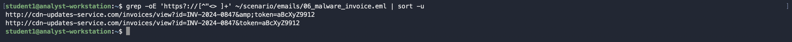
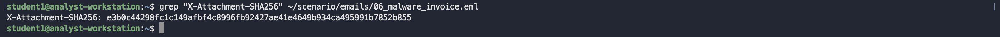
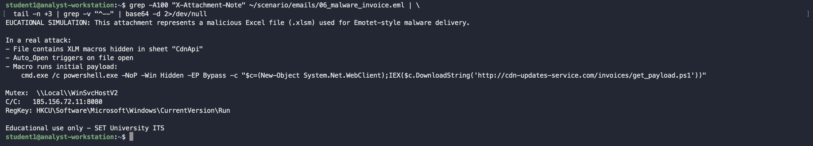
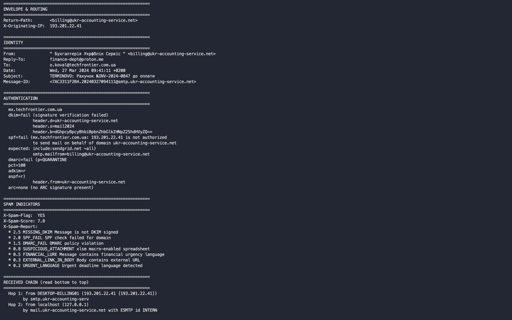
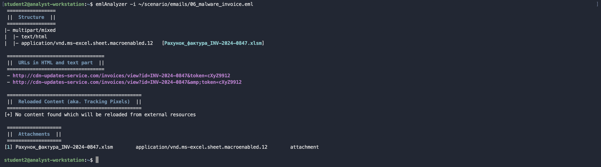

# Аналіз структури та вмісту електронної пошти

**Модуль:** Email Forensics | **Крок:** 1.4

---

## Мета

Навчитися аналізувати структуру `.eml` файлу, витягувати технічні індикатори компрометації (IOC) з заголовків та тіла листа, та використовувати спеціалізовані інструменти для форензік аналізу електронної пошти.

---

## Файл для аналізу

```
/home/analyst/scenario/emails/06_malware_invoice.eml
```

Або завантажити через веб-інтерфейс: **http://localhost:8086** → «Завантажити .eml»

---

## Частина 1 — Структура .eml файлу

Перед тим як використовувати інструменти — розберись, що таке `.eml`.

### 1.1 Анатомія email повідомлення

```
┌─────────────────────────────────────────┐
│           ENVELOPE                      │
│  Return-Path, Delivered-To              │
├─────────────────────────────────────────┤
│           HEADERS                       │
│  Received (chain), From, To, Subject    │
│  Date, Message-ID, MIME-Version         │
│  Authentication-Results (SPF/DKIM/DMARC)│
│  X-* (custom headers)                   │
├─────────────────────────────────────────┤
│           BODY                          │
│  text/plain або text/html               │
│  (може бути base64 або quoted-printable)│
├─────────────────────────────────────────┤
│           ATTACHMENTS                   │
│  MIME parts з Content-Disposition:      │
│  attachment                             │
└─────────────────────────────────────────┘
```

### 1.2 Received chain — маршрут листа

Читається **знизу вгору** — останній `Received` це найперший сервер:

```
Received: from DESKTOP-BILLING01 (193.201.22.41)   ← 1. Відправник
Received: from localhost (127.0.0.1)                ← 2. ⚠ АНОМАЛІЯ
Received: from mail.ukr-accounting-service.net      ← 3. Relay
Received: from mx.techfrontier.com.ua               ← 4. Отримувач
```

**Що підозріло:** `from localhost (127.0.0.1)` — сервер відправляє сам собі? Це ознака підробленого hop.

---

## Частина 2 — Поля для витягнення та аналізу

### 2.1 Обов'язкові поля

| Поле | Команда для витягнення | На що звернути увагу |
|---|---|---|
| `From` | `grep "^From:"` | Домен відповідає бренду? |
| `Return-Path` | `grep "^Return-Path:"` | Відрізняється від `From`? |
| `Reply-To` | `grep "^Reply-To:"` | Gmail/Proton замість корпоративного? |
| `X-Originating-IP` | `grep "X-Originating-IP"` | Перевірити на AbuseIPDB |
| `Date` | `grep "^Date:"` | Timezone відповідає? |
| `Message-ID` | `grep "^Message-ID:"` | Домен після @ = домен відправника? |
| `Subject` | `grep "^Subject:"` | base64? Urgency language? |

### 2.2 Автентифікація

| Поле | Очікуване | Підозріле |
|---|---|---|
| `spf=` | `pass` | `fail` або `softfail` |
| `dkim=` | `pass` | `fail` або `none` |
| `dmarc=` | `pass` | `fail` |
| `arc=` | присутній | `none` |

### 2.3 Спам-індикатори

| Поле | Що означає |
|---|---|
| `X-Spam-Flag: YES` | Спам-фільтр спрацював |
| `X-Spam-Score: 7.8` | Оцінка ризику (> 5 = підозріло) |
| `X-Spam-Report` | Детальний список спрацьованих правил |
| `X-Priority: 1` | Штучна терміновість |

### 2.4 Body — на що звернути увагу

| Елемент | Ознака атаки |
|---|---|
| `<a href="X">Y</a>` де X ≠ Y | Прихований URL |
| `` | Tracking pixel |
| `активуйте вміст` / `enable content` | Соціальна інженерія для макросів |
| Urgency: `залишилось 4 дні` | Тиск на жертву |
| `docs.google.com` у тексті але C2 у href | Підробка легітимного сервісу |

### 2.5 Вкладення

| Поле | Що перевірити |
|---|---|
| `Content-Type` | `.xlsm` = macro-enabled = небезпечно |
| `X-Attachment-SHA256` | Завантажити на VirusTotal |
| Подвійне розширення | `invoice.pdf.exe` — справжнє розширення останнє |
| Base64 decode тіла | Що насправді в середині? |

---

## Частина 3 — Інструменти аналізу

### 3.1 Онлайн (без встановлення)

| Інструмент | Посилання | Використання |
|---|---|---|
| **MXToolbox Header Analyzer** | `mxtoolbox.com/EmailHeaders.aspx` | Вставити Raw Headers → аналіз Received chain |
| **Google Admin Toolbox** | `toolbox.googleapps.com/apps/messageheader` | Візуалізація маршруту + затримки між hop |
| **EML Analyzer** | `eml-analyzer.netlify.app` | Завантажити `.eml` → повний розбір |
| **PhishTool** | `phishtool.com` | Фішинг аналіз + автоматичний IOC витяг |
| **AbuseIPDB** | `abuseipdb.com/check/193.201.22.41` | Репутація IP відправника |
| **VirusTotal** | `virustotal.com/gui/file` | Хеш вкладення або URL аналіз |
| **URLScan.io** | `urlscan.io` | Сканування підозрілих URL |
| **MXToolbox SPF** | `mxtoolbox.com/spf.aspx` | Перевірити SPF запис домену |

### 3.2 Офлайн — командний рядок (Linux)

**Швидкий аналіз заголовків:**
```bash
# Витягнути всі ключові заголовки
grep -E "^(From|To|Reply-To|Return-Path|Date|Subject|Message-ID|X-Originating-IP|X-Spam-Score|X-Spam-Flag|DKIM-Signature):" \
    ~/scenario/emails/06_malware_invoice.eml
```


**Received chain (маршрут листа):**
```bash
grep "^Received:" ~/scenario/emails/06_malware_invoice.eml
```


**Декодувати Subject:**
```bash
grep "^Subject:" ~/scenario/emails/06_malware_invoice.eml \
  | grep -oP '(?<=\?B\?)[^?]+' | base64 -d 2>/dev/null && echo
```


**Всі URL у листі:**
```bash
grep -oE 'https?://[^"<> ]+' ~/scenario/emails/06_malware_invoice.eml | sort -u
```


**Tracking pixel:**
```bash
grep -i "width.*[\"']1[\"'].*height\|height.*[\"']1[\"'].*width\|pixel\|track" \
    ~/scenario/emails/06_malware_invoice.eml
```

**Приховані посилання (href ≠ текст):**
```bash
cat ~/scenario/emails/06_malware_invoice.eml | tr '\n' ' ' | \
  grep -oE '<a href="[^"]+">.*?</a>' | sed 's|</a>|</a>\n|g'
```

**SHA256 вкладення:**
```bash
grep "X-Attachment-SHA256" ~/scenario/emails/06_malware_invoice.eml
```


**Декодувати base64 тіло вкладення:**
```bash
grep -A100 "X-Attachment-Note" ~/scenario/emails/06_malware_invoice.eml | \
  tail -n +3 | grep -v "^--" | base64 -d 2>/dev/null
```



### 3.3 Офлайн — Python скрипт

```bash
python3 << 'PYEOF'
import email, email.policy, re
from email.header import decode_header, make_header

with open('/home/analyst/scenario/emails/06_malware_invoice.eml', 'rb') as f:
    msg = email.message_from_bytes(f.read(), policy=email.policy.compat32)

def dh(v):
    try: return str(make_header(decode_header(v or '')))
    except: return v or '—'

print("=" * 60)
print("ENVELOPE & ROUTING")
print("=" * 60)
print(f"Return-Path:       {msg.get('Return-Path','—')}")
print(f"X-Originating-IP:  {msg.get('X-Originating-IP','—')}")

print("\n" + "=" * 60)
print("IDENTITY")
print("=" * 60)
print(f"From:              {dh(msg.get('From','—'))}")
print(f"Reply-To:          {msg.get('Reply-To','—')}")
print(f"To:                {msg.get('To','—')}")
print(f"Date:              {msg.get('Date','—')}")
print(f"Subject:           {dh(msg.get('Subject','—'))}")
print(f"Message-ID:        {msg.get('Message-ID','—')}")

print("\n" + "=" * 60)
print("AUTHENTICATION")
print("=" * 60)
auth = msg.get('Authentication-Results','—')
for line in auth.split(';'):
    print(f"  {line.strip()}")

print("\n" + "=" * 60)
print("SPAM INDICATORS")
print("=" * 60)
print(f"X-Spam-Flag:  {msg.get('X-Spam-Flag','—')}")
print(f"X-Spam-Score: {msg.get('X-Spam-Score','—')}")
report = msg.get('X-Spam-Report','')
if report:
    print("X-Spam-Report:")
    for line in report.strip().split('\n'):
        print(f"  {line.strip()}")

print("\n" + "=" * 60)
print("RECEIVED CHAIN (read bottom to top)")
print("=" * 60)
received = msg.get_all('Received', [])
for i, r in enumerate(reversed(received)):
    print(f"  Hop {i+1}: {r.strip()[:90]}")

print("\n" + "=" * 60)
print("ATTACHMENTS")
print("=" * 60)
for part in msg.walk():
    if part.get_content_disposition() == 'attachment':
        fname = dh(part.get_filename() or 'unnamed')
        ctype = part.get_content_type()
        sha = msg.get('X-Attachment-SHA256','—')
        print(f"  Name:  {fname}")
        print(f"  Type:  {ctype}")
        print(f"  SHA256:{sha}")

print("\n" + "=" * 60)
print("URLS IN BODY")
print("=" * 60)
body = ''
if msg.is_multipart():
    for part in msg.walk():
        if part.get_content_type() in ('text/html','text/plain'):
            payload = part.get_payload(decode=True)
            if payload:
                body += payload.decode(part.get_content_charset() or 'utf-8', errors='replace')
else:
    payload = msg.get_payload(decode=True)
    if payload:
        body = payload.decode(msg.get_content_charset() or 'utf-8', errors='replace')

urls = re.findall(r'https?://[^\s"<>]+', body)
for u in sorted(set(urls)):
    print(f"  {u}")

PYEOF
```


### 3.4 Офлайн — emlAnalyzer (Python CLI)

```bash
# Запустити
emlAnalyzer -i ~/scenario/emails/06_malware_invoice.eml

# Витягнути вкладення
emlAnalyzer -i ~/scenario/emails/06_malware_invoice.eml --extract-attachment
```


---

## Частина 4 — Завдання для звіту

### Завдання 4.1 — Заповни таблицю IOC

Використовуючи будь-який інструмент вище, заповни:

| # | Поле / Елемент | Знайдене значення | Тип IOC |
|---|---|---|---|
| 1 | `X-Originating-IP` | | Network |
| 2 | `SPF` результат | | Auth |
| 3 | `DKIM` результат | | Auth |
| 4 | `DMARC` результат | | Auth |
| 5 | `Reply-To` домен | | Social engineering |
| 6 | `X-Spam-Score` | | Spam |
| 7 | Підозрілий hop у Received chain | | Routing |
| 8 | URL у кнопці (href) | | Network |
| 9 | Відображуваний текст посилання | | Deception |
| 10 | Tracking pixel URL | | Network |
| 11 | SHA256 вкладення | | File |
| 12 | Subject (декодований) | | Social engineering |

### Завдання 4.2 — Питання для відповіді

1. Чому `From` та `Reply-To` мають різні домени і що це означає для атаки?
2. Що таке tracking pixel і яку інформацію зловмисник отримує коли жертва відкриває лист?
3. Знайди приховане посилання — що відображається жертві і куди насправді веде href?
4. Чому `Received: from localhost (127.0.0.1)` є аномалією?
5. Перевір `X-Originating-IP: 193.201.22.41` на AbuseIPDB — що знайшов?
6. Перевір SHA256 вкладення на VirusTotal — що показує?
7. Скільки правил спрацювало в `X-Spam-Report` і які найбільш критичні?

---

## Чеклист для самоперевірки

```
[ ] SPF FAIL — причина встановлена
[ ] DKIM FAIL — підпис невалідний
[ ] DMARC FAIL — policy порушена
[ ] Reply-To → proton.me (не корпоративний)
[ ] Received chain містить localhost (підроблений hop)
[ ] X-Spam-Score > 5.0
[ ] X-Originating-IP перевірений на AbuseIPDB
[ ] Subject декодований з base64
[ ] Tracking pixel знайдений → URL зафіксований
[ ] Приховане посилання: href ≠ відображуваний текст
[ ] SHA256 вкладення перевірений на VirusTotal
[ ] C2 домен у URL перевірений на URLScan.io
```

---

*Forensics |  Fake Invoice (Emotet-style XLSM Dropper)| EDUCATIONAL USE ONLY | Rifat Ismailov*